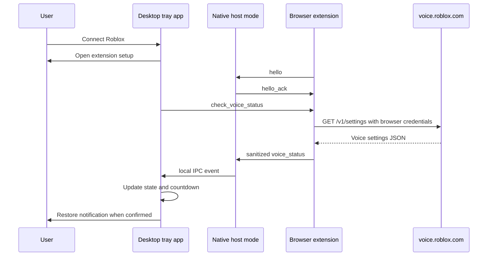

# Architecture

Voice Watch is split into two local components:

1. A Rust Windows desktop app.
2. A Chrome/Edge Manifest V3 browser extension.

The browser extension owns authenticated Roblox API access because the browser
already has the user's Roblox session. The desktop app owns local UX: tray menu,
countdown, restore notification, settings, process detection, and rejoin action.

## Data flow



The local IPC bridge between native host mode and the already running tray app
is represented by `src/ipc.rs`. The first prototype has the trait boundary and
native host acknowledgement; the named-pipe implementation is planned next.

## Rust slices

- `messages.rs` defines the sanitized protocol shared by the extension and app.
- `native_messaging.rs` reads and writes Chrome/Edge native messaging frames.
- `app_state.rs` owns the voice state machine.
- `countdown.rs` keeps countdown rendering local and monotonic.
- `monitor.rs` decides when polling should happen.
- `process.rs` checks whether Roblox is running.
- `roblox_logs.rs` extracts best-effort server information from local logs.
- `rejoin.rs` converts last-server metadata into a user-clicked target.
- `overlay.rs` owns restore notification behavior.
- `tray.rs` owns desktop tray runtime wiring.
- `settings.rs` persists and validates local settings.

## State model

```text
Disconnected
Connected
RobloxNotRunning
Checking
VoiceOk
TempSuspended
SuspendedUnknownDuration
Ineligible
AuthError
NetworkError
RateLimited
ExpiredChecking
Restored
```

The app renders countdowns locally from `bannedUntilMs`. When the countdown
reaches zero, it must check the real status again before showing the restored
notification.
