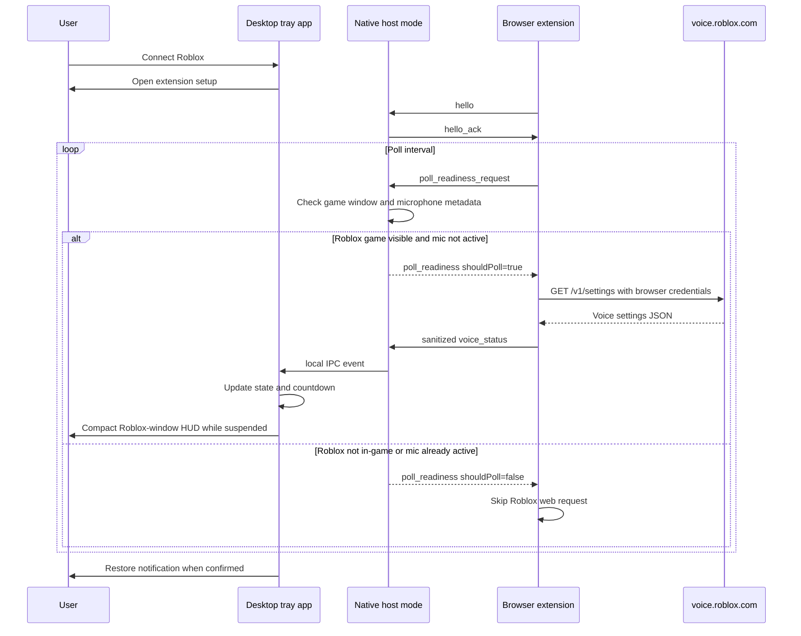

# Architecture

Voice Watch is split into two local components:

1. A Rust Windows desktop app.
2. A Chromium Manifest V3 browser extension.

The browser extension owns authenticated Roblox API access because the browser
already has the user's Roblox session. The desktop app owns local UX: tray menu,
countdown, restore notification, settings, Roblox game-window detection,
microphone activity detection, and rejoin action.

## Runtime goal

The app is built to answer "is Roblox voice chat restored yet?" without turning
into a credential tool or a noisy background poller.

The desktop app never receives Roblox cookies. The extension performs the Roblox
request with normal browser session handling, then sends only sanitized status
fields to the desktop app. Before each web request, the extension asks the
desktop app whether a check is useful:

- If no visible Roblox game window exists, polling is paused.
- If Roblox is actively using the microphone, polling is paused because VC is
  already active.
- If the last sanitized Roblox response contains a future `bannedUntilMs`, the
  extension sleeps until that local countdown expires before asking Roblox
  again.
- Otherwise, the extension checks Roblox voice status at the configured
  interval.

## Data flow



The local IPC bridge between native host mode and the already running tray app
is represented by `src/ipc.rs`. The first prototype has the trait boundary and
native host acknowledgement; the named-pipe implementation is planned next.

## Rust slices

- `messages.rs` defines the sanitized protocol shared by the extension and app.
- `native_messaging.rs` reads and writes Chromium native messaging frames.
- `app_state.rs` owns the voice state machine.
- `countdown.rs` keeps countdown rendering local and monotonic.
- `monitor.rs` decides when polling should happen.
- `process.rs` checks for a visible Roblox game window and Windows microphone
  activity metadata for Roblox.
- `roblox_logs.rs` extracts best-effort server information from local logs.
- `rejoin.rs` converts last-server metadata into a user-clicked target.
- `overlay.rs` owns the compact suspension/restored HUD and restore notification
  fallback.
- `tray.rs` owns desktop tray runtime wiring.
- `settings.rs` persists and validates local settings.

## State model

```text
Disconnected
Connected
RobloxNotRunning
Checking
VoiceOk
TempSuspended
SuspendedUnknownDuration
Ineligible
AuthError
NetworkError
RateLimited
ExpiredChecking
Restored
```

The app renders countdowns locally from `bannedUntilMs`. When the countdown
reaches zero, it must check the real status again before showing the restored
notification.
