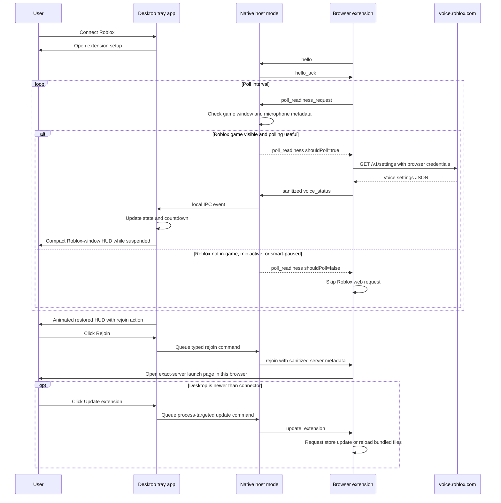

# Architecture

Voice Watch is split into two local components:

1. A Rust Windows desktop app.
2. A Manifest V3 browser extension, packaged for Chromium-based browsers and
   Firefox.

The browser extension owns authenticated Roblox API access because the browser
already has the user's Roblox session. The desktop app owns local UX: tray menu,
countdown, restore notification, settings, Roblox game-window detection,
microphone activity detection, rejoin action, and update prompts.

## Runtime goal

The app is built to answer "is Roblox voice chat restored yet?" without turning
into a credential tool or a noisy background poller.

The desktop app never receives Roblox cookies. The extension performs the Roblox
request with normal browser session handling, then sends only sanitized status
fields to the desktop app. Before each web request, the extension asks the
desktop app whether a check is useful:

- If no visible Roblox game window exists, polling is paused.
- If Roblox is actively using the microphone, polling is paused because VC is
  already active.
- If smart polling is enabled and the mic has been quiet for more than 20
  seconds after a successful not-suspended response, polling is paused until
  local activity makes another check useful.
- If the last sanitized Roblox response contains a future `bannedUntilMs`, the
  extension sleeps until that local countdown expires before asking Roblox
  again.
- Otherwise, the extension checks Roblox voice status at the configured
  interval.
- Current-server presence is refreshed at most once per minute and only while
  the desktop reports a visible Roblox game window. The authenticated user ID is
  cached for five minutes inside the extension service worker.

## Data flow



The local IPC bridge between native host mode and the already running tray app
is represented by `src/ipc.rs`. It uses a bounded append-only event file for
host-to-tray events, one atomic shared command file for ordinary actions, and
per-host command files when every outdated connected browser must receive an
extension update request. Versioned live-host markers let the tray compare each
connector independently. The last sanitized voice status and server metadata
are cached separately so a tray restart does not lose a known suspension
countdown.

## Rust slices

- `messages.rs` defines the sanitized protocol shared by the extension and app.
- `native_messaging.rs` reads and writes browser native messaging frames and
  evaluates polling readiness.
- `app_state.rs` owns the voice state machine.
- `countdown.rs` keeps countdown rendering local and monotonic.
- `process.rs` checks for a visible Roblox game window and Windows microphone
  activity metadata for Roblox.
- `roblox_logs.rs` extracts best-effort server information from local logs,
  including `GameId`/`gameInstanceId` and private-server access/link codes when
  Roblox records them.
- `rejoin.rs` validates last-server metadata and builds local fallback targets;
  the normal path is a typed command to the connected extension.
- `overlay.rs` owns the compact suspension/restored HUD and restore sound.
- `settings_window.rs` owns the native settings UI.
- `updates.rs` checks GitHub Releases, downloads installer updates, and owns the
  temporary helper mode used to install after the tray app exits.
- `tray.rs` owns desktop tray runtime wiring.
- `settings.rs` persists and validates local settings.

## State model

```text
Disconnected
Connected
Checking
VoiceOk
TempSuspended
SuspendedUnknownDuration
Ineligible
AuthError (shown as Logged out)
NetworkError
RateLimited
Restored
```

The app renders countdowns locally from `bannedUntilMs`. When the countdown
reaches zero, the tray app moves directly into the restored HUD state and keeps
the next browser status check as a correction path if Roblox later disagrees.
Roblox browser authentication failures are still treated as an active desktop
connection; both the tray and extension render them as `Logged out`.
